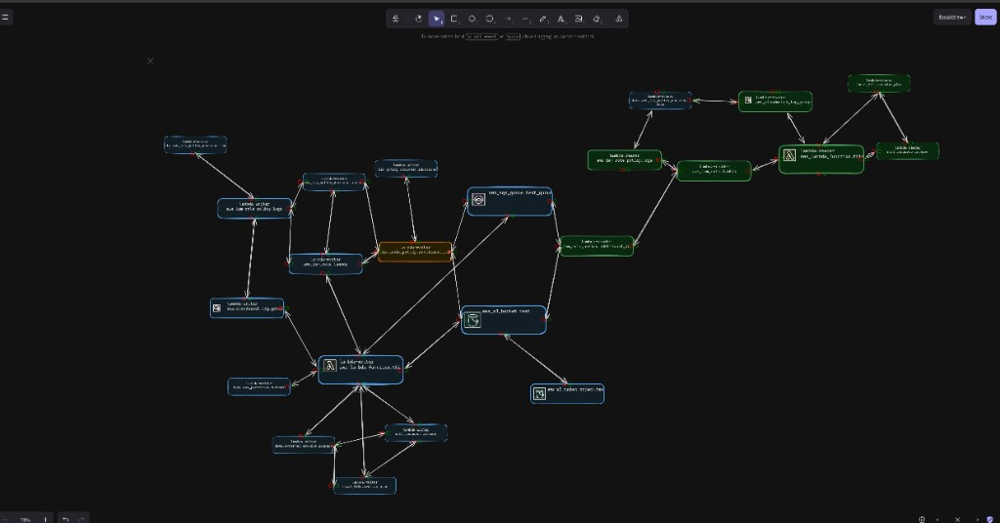

# Excalidraw (Terraform fork)

A **fork of [Excalidraw](https://excalidraw.com)** that imports a **Terraform plan** (via `terraform show` / plan JSON and the dependency graph) and **generates an Excalidraw canvas** for you—turning your infrastructure into an editable, hand-drawn style diagram.

Upload your Terraform plan JSON and graph (DOT), and the app builds a canvas of nodes (resources) and edges (dependencies) that you can pan, zoom, and edit like any Excalidraw drawing.



<p align="center">
  <a href="https://github.com/excalidraw/excalidraw/blob/master/LICENSE">
    
  </a>
</p>

---

## What this fork adds

- **Terraform import** — Upload a Terraform plan (JSON) and its dependency graph (DOT from `terraform graph` or equivalent). The backend parses both and returns a graph of resources and relationships.
- **Excalidraw canvas from the graph** — The graph is used to create (or populate) an Excalidraw scene: nodes become shapes, edges become arrows, so you get an interactive diagram of your infrastructure.
- **Backend pipeline** — A small Node/Express server that:
  - Accepts plan + DOT file uploads
  - Builds adjacency lists, new vs existing edges, and resource diffs
  - Writes intermediate artifacts to `backend/temp/` and returns the final node graph (e.g. for the frontend to render on the canvas)

The rest is standard Excalidraw: hand-drawn style, zoom/pan, export to PNG/SVG, and the usual editor tools.

---

## Quick start

**Run the app (frontend + backend):**

```bash
yarn install
yarn start          # Excalidraw app (e.g. Vite dev server)
# In another terminal:
node backend/index.js   # Backend on http://localhost:3000
```

Then use the **Terraform Import** flow in the app (e.g. from the menu or shortcut) to upload:

1. **Plan file** — JSON from `terraform show -json <planfile>` (or your plan output saved as JSON).
2. **Graph file** — DOT output (e.g. from `terraform graph` or your plan’s graph representation).

The backend processes both and returns the graph; the app can then draw it on the Excalidraw canvas.

---

## Development

- **Type checking:** `yarn test:typecheck`
- **Tests:** `yarn test:update`
- **Lint / format:** `yarn fix`
- **Build packages:** `yarn build:packages`
- **Build app:** `yarn build:app`

See the main [Excalidraw documentation](https://docs.excalidraw.com) and [development guide](https://docs.excalidraw.com/docs/introduction/development) for the core editor.

---

## Upstream Excalidraw

This repo is built on [Excalidraw](https://github.com/excalidraw/excalidraw): an open-source, collaborative whiteboard with a hand-drawn look. We keep the existing Excalidraw features (canvas, tools, export, etc.) and add the Terraform import pipeline and graph-to-canvas flow on top.

- [Excalidraw](https://excalidraw.com) · [Docs](https://docs.excalidraw.com) · [License (MIT)](https://github.com/excalidraw/excalidraw/blob/master/LICENSE)
